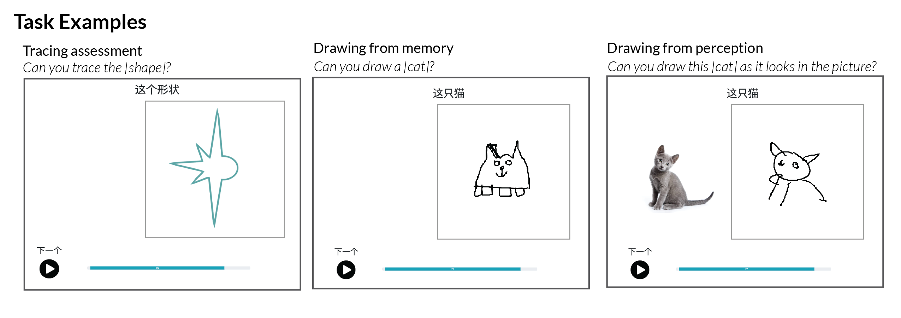
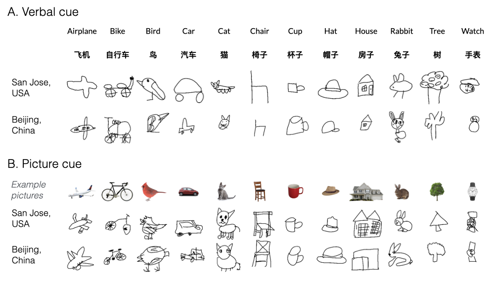

```{r setup, include = FALSE}
library("papaja")
library(tidyverse)
library(here)
library(assertthat)
library(langcog)
library(ggthemes)
library(knitr)
library(lmerTest)
library(lme4)
library(xtable)
library(viridis)
```

As humans, we have many powerful tools to externalize what we know, including language and gesture. 
One tool that has been transformative for human cognition and culture is graphical representation, which allows people to encode their thoughts in a visible, durable format. 
Drawing is an important case study in graphical representation, being a technique that dates back 60,000 years [@hoffmann2018u], well before the emergence of symbolic writing systems, and is practiced in many cultures.

In modern times, drawings are produced prolifically by children from an early age. 
Figurative drawings have long provided inspiration for scientists investigating children's emerging cognitive abilities [@minsky1972artificial], and accordingly a long history of work has examined changes in children's drawings across development [@piaget1929child; @kellogg1969analyzing; @karmiloff1990constraints; @fury1997children].
Indeed, there appear to be dramatic changes in how children encode diagnostic visual information in their drawings across age; younger children (4-5 years) tend to include fewer cues in their drawings to differentiate between target concepts (e.g., \textit{adult} vs. \textit{child}) than older children, who enrich their drawings with more diagnostic part [@sitton1992drawing] and relational [@light1983effects] information. 
 
What drives these dramatic changes in children's drawings across development? 
A common view is that these changes are driven primarily by children's increasing ability to plan and control their motor movements [@freeman1987current; @rehrig2018does]. 
While such changes in visuomotor control are clearly important, this view fails to account for other important constraints, such as how well children are able to access previously acquired semantic knowledge about each target concept and maintain this information in working memory during drawing production.
In our prior work, we found some evidence that these changes in children's drawings are accompanied by changes in children's ability to recognize drawings of object categories: in a correlational study, older children produced drawings of object categories that were more diagnostic of the categories they are trying to depict [@long2018drawings; @long2021parallel] and tended to rely more on these diagnostic visual features during recognition. 
Thus, drawing is a skill that likely also relies on children's evolving perceptual category representations [@long2018drawings; @natu2016development; @dekker2011dorsal] as well as their increasing working memory capacity [@pailian2016visual].

Here, we directly test the idea that a principal reason younger children produce less recognizable drawings is because they simply have more difficulty recalling the relevant perceptual features of different categories: that is, when asked to "draw a [rabbit]", they may struggle to conjure up the relevant perceptual details and then hold in mind what rabbits tend to look like. 
On this account, providing children with additional perceptual information about different categories -- for example, canonical photographs of typical exemplars -- could help them improve their drawings of these categories, as it does with adults [@fan2020relating]. 
However, prior work also suggests that younger children tend to draw what they know about objects rather than integrate the information in their immediate perceptual experience.  
For example, when asked to draw from observation, younger children tend to include features that are not visible from their vantage point, yet are diagnostic of category membership (e.g., a handle on a \textit{mug}) [@bremmer1984prior; @barrett1976symbolism], and only omit these features later in development. 
Similarly, young children will insist that their nearly identical drawings of different concepts (e.g., balloon and person) unambiguously refer to different things [@bloom1998intention]. 
Thus, an alternative possibility is that only older children may be able to produce more recognizable drawings when provided with canonical exemplars of different categories. 
On this account, changes in children's drawings from memory across age may be largely due to other factors beyond changes in memory -- for example, changes in how children represent the diagnostic visual features of each category [@long2018drawings]. 

To tease apart these alternatives, we investigated the development of children's ability to produce recognizable drawings of visual concepts when children were provided with a verbal cue ("Can you draw a [rabbit]?) versus when provided with a picture cue ("Can you draw this [rabbit] as it looks in the picture?"). On verbal-cue trials, children thus must access their mental representation of a "rabbit" and choose the features necessary to convey that object's identity. Conversely, on picture-cue trials, children are explicitly asked to rely on the visual features provided in a canonical photograph of each object category. 

Second, we tested the generalizability of our findings across different populations by recruiting children from two different sites in different countries — San Jose, USA and Beijing, China.
Most empirical studies on children's drawings have been conducted exclusively on small samples of children from the United States or Western Europe, limiting their generalizability. Further, children in different communities may spend more or less time practicing drawing or use different visual conventions to draw [@cohn2012explaining; @willats2006making]. While some prior work has focused on differences in children's drawings across these two countries, most of this descriptive work has focused on differences in educational practices that may account for any observed differences [@la2001children; @winner1989can; @huntsinger2011cultural]. Instead, here we focus on the degree to which the overall developmental trajectory of drawing abilities are similar between children at these two sites. 

Finally, we assessed the degree to which visuomotor development accounts for observed developmental changes in drawing recognizability. While it is clear that visuomotor control influences how and what we can draw, little work has directly related meausres of visuomotor control to drawing outcomes. To do so, we measured each child's visuomotor control via a shape tracing task on a table and related these measurements of tracing accuracy to the recognizability of the drawings that each child produced. 

In the present study, we thus collect shape tracings and digital drawings of visual concepts from 4-9 year-old children in two different countries using both picture cues and verbal cues.  In doing so, we make three major contributions to our understanding of the development of children's drawings. First, we replicate our prior findings  [@long2021parallel] that the recognizability of children's drawings increases steadily throughout this age range (4-9 years). Second, we test the degree to which working memory constraints might account for these developmental changes. In keeping with accounts of naïve realism and contra a strong account of working memory limitations, we predicted that only older children would be able to use the visual information present in the canonical photographs to improve their drawings, Third, we test the generalizability of our findings across two different countries. We predicted that we would see convergence in the development of drawing abilities across both geographical sites, with older children becoming progressively better at producing recognizable drawings. In addition, we predicted that most of the variance across geographical sites in drawing ability would be explainable by differences in visuomotor control, operationalized as performance on a shape tracing task; these primary analyses were pre-registered at https://osf.io/qymjr/.


<!-- Overall, we replicated prior work [@long2021parallel], showing strong and consistent developmental changes in the recognizability of children's drawings across development across both geographical sites. In addition, children of all ages produced equally recognizable drawings across both drawing tasks, suggesting that working memory limitations are not amoung the primary factors that influence the recognizability of children's drawings. Finally, we found that children recruited  -->


# Methods
```{r plotting-params}
base_size_chosen=12; smooth_alpha=.2
```

```{r load-classifications}
classification_data <- read.csv(here::here('data/compiled/compiled_classifications/Classification_Outputs2760.csv')) %>%
  as_tibble() %>%
  mutate(age_numeric = age) %>%
  mutate(age = paste('age',age,sep="")) %>%
  mutate(age = as.factor(age)) %>%
  mutate(category = target_label) %>% 
  dplyr::select(-X, -X.1, -index) %>%
  mutate(site = case_when( is.na(str_locate(session_id,'photodraw_e2')[,1]) ~ "THU", 
                           !is.na(str_locate(session_id,'photodraw_e2')[,1]) ~ "CDM")) %>%
  mutate(site = as.factor(site)) 
```

```{r load-metadata}
# load and clean up "category" for tracing trials
all_meta <- read.csv(here::here('data/compiled/metadata/final_merged_metadata.csv')) %>%
    mutate(category = as.character(category)) %>%
    mutate(category = case_when(category == 'this square' ~ 'square',
                                category == 'this shape' ~ 'shape',                                
                                TRUE ~ as.character(category))) 

# subIDs are unique identifier in recognition data for THU, session_ids in CDM data
meta_thu <- all_meta %>%
  filter(site=='THU') %>%
  mutate(unique_ids = subID) %>%
  mutate(draw_duration = draw_duration / 1000) # in ms for thu, whoops

meta_cdm <- all_meta %>%
  filter(site=='CDM') %>%
  mutate(unique_ids = session_id) 

## unique IDs are now the identifier which will be used to join with machine/human recognition data
all_meta_cleaned <- meta_cdm %>%
  full_join(meta_thu) 
```

\
```{r load-tracing}
# import, standardized spliced session_ids, and join back together
# tracing IDs are read in by session_ids, so need these to join with metadata
tracing_thu <- read.csv(here::here('data/compiled/tracing_outputs/transformed_tracings.csv'))  %>%
  mutate(session_id =  paste0('Tsinghua_photodraw_',session_id)) %>%
  filter(site=='Tsinghua') %>%
  left_join(meta_thu, by=c('session_id','category')) %>%
  dplyr::select(-X.1, -X, -site.x, -filename.y) %>%
  rename(site = site.y, filename = filename.x) 

tracing_cdm <- read.csv(here::here('data/compiled/tracing_outputs/transformed_tracings.csv'))  %>%
  filter(site=='CDM') %>%
  mutate(session_id = paste0('photodraw_',session_id)) %>%
  left_join(meta_cdm, by=c('session_id','category')) %>%
  dplyr::select(-X.1, -X, -site.x, -filename.y) %>%
  rename(site = site.y, filename = filename.x) 
  
# for modeling tracing scores for each shape (square/shape) separately for each participant
all_tracing <- tracing_thu %>%
  full_join(tracing_cdm) 

# for per-subject tracing estimates
tracing_by_sub <- all_tracing %>%
  group_by(unique_ids) %>%
  summarize(avg_tracing_score = mean(rating))
```

```{r join-data}
model_classifications <- classification_data %>%
  mutate(unique_ids = session_id) %>%
  left_join(all_meta_cleaned %>% dplyr::select(unique_ids, category, condition, num_strokes, draw_duration, mean_intensity)) %>% # need to select columns so we don't get join errors 
  left_join(tracing_by_sub)
  

# bizarrely, there are a few drawings from THU for which stroke data didn't save -- technical error.
# this was checked directly in mongodb database -- no idea why, assuming bad internet.
tech_error_drawings <- model_classifications %>%
  filter(is.na(num_strokes))
# filter out tech error drawings from dataset (24)
model_classifications <- model_classifications%>%
  filter(!is.na(num_strokes)) 

```

```{r load-human-recognition}
humans <- read.csv(here::here('data/compiled/recognition_ratings/compiled_human_recognition.csv')) 
  
```

```{r join-human-rec-with-meta}
d <- humans %>%
  group_by(unique_ids, category, image_name_short, site, age) %>% # group by each drawing of each category
  summarize(num_correct = sum(correct_or_not==TRUE), num_incorrect = sum(correct_or_not==FALSE), prop_correct = mean(correct_or_not))  %>%
   left_join(all_meta_cleaned %>% dplyr::select(unique_ids, category, condition, num_strokes, draw_duration, mean_intensity)) %>%
  mutate(age_numeric = age) %>%
  mutate(age_numeric = as.double(age_numeric)) %>%
  mutate(age_numeric = case_when(age_numeric == 10 ~ 9, # merge 2 10-year-olds into THU data for 9-year-olds
                                 TRUE ~ age_numeric)) %>%
  left_join(tracing_by_sub) %>%
  mutate(site = fct_recode(site, "San Jose" = "CDM", "Beijing" = "THU"))%>%
  mutate(condition = fct_recode(condition, "Picture cue" = "P", "Verbal cue" = "S")) 

humans_and_models_merged <- humans %>%
  group_by(unique_ids, category, image_name_short) %>% # group by each drawing of each category
  summarize(prop_correct = mean(correct_or_not)) %>%
  left_join(model_classifications, by=c('unique_ids','category')) %>% # join with classification data 
  filter(!is.na(age))
```

```{r count-participants}
participant_counts <- d %>%
  group_by(age_numeric, site) %>%
  summarize(num_participants = length(unique(unique_ids))) 

count_by_site <- d %>%
  group_by(site) %>%
  summarize(num_participants = length(unique(unique_ids))) 

count_by_category <- d %>%
  group_by(category) %>%
  summarize(num_drawings = length(unique(unique_ids)))

count_by_id <- d %>%
  group_by(unique_ids) %>%
  summarize(num_drawings = length(unique(category))) 
```

## Participants
265 participants were recruited from two local children's museum in [BLINDED] and preschool and elementary schools outside of Beijing; approximately equal numbers of participants were recruited in Northern California and the Beijing area. Our goal was to recruit 120 children between 4-9 years of age after exclusions (i.e. 20 4-year-olds, 20 5-year-olds, etc.) at each geographical site. In the San Jose based sample, 135 children participated in the experiment; 6 participants were excluded, (3) for skipping more than 6 drawing trials and (3) for scribbling three or more times in a row. Six additional participants were tested but their data was not recorded due to a technical error, and two participants never advanced past the practice trials, leading to a final sample of `r count_by_site$num_participants[1]` children. In the Beijing based sample, `r count_by_site$num_participants[2]` children participated; an additional 8 participants were tested but their data was not recorded due to a technical error with the remote database. Two 10-year-olds (aged 10 years, 0 months and 10 years, 1 month) were accidentally tested and included in the 9-year-old age group. On average, each child contributed `r mean(count_by_id$num_drawings)` drawings to analysis (min `r min(count_by_id$num_drawings)`, max = `r max(count_by_id$num_drawings)`). No additional demographic data was recorded about the participants. This protocol was approved by both the Institutional Review Board at [blinded] (43992, Development of Children's Drawing Abilities) and the Department of Psychology Ethics Committee at [blinded] in Beijing, China.

## Task Procedure
Before beginning, a trained experimenter first told each child “After this game is over, someone is going to try to recognize what you were trying to draw. So, please draw so that someone else could try what you were trying to draw.” A native English speaker gave these instructions to the San Jose based sample, and a native Mandarin speaker gave a translation of these instructions to the Beijing based sample. The rest of the instructions were given via audio and video cues of native English/Mandarin speakers, respectively; all experimental code, videos, and stimuli are available on the public repository for this project. All children used their fingers to draw on an Ipad Pro (12.9") that was set at a slight angle on a table via a tablet case.  All experimental code, videos, and data are available on the public repository for this project.

Children first completed two series of tracing trials to obtain an estimate of their tracing abilities; children were first asked to trace a square and then a complex shape (see Figure \ref{fig:example-tasks}). Children had maximum of 30 seconds to produce their tracings/drawings on all trials, and strokes could not be deleted once drawn; stroke-by-stroke data for each drawing was stored on a remote server.

The primary experimental manipulation was the drawing task that children participated in; each child completed both tasks and the order of tasks was counterbalanced across participants. Overall, each child completed 2 tracing trials and 12 drawing trials, with six categories randomly assigned to each condition and displayed in a random order. on verbal-cue trials, children saw a short video clip where an experimenter said,  “What about a [cat]? Can you draw a [cat]?” (exact Mandarin translation has trouble in latex). On picture-cue trials, children heard audio of the same experimenter who said,  “What about this [cat]? Can you draw the [cat] as it looks in the picture?”  (Mandarin translation) while seeing a canonical photograph of each category; this photograph then remained on the screen for the duration of the drawing trial.  This photograph was randomly sampled from one of three possible exemplars. Task examples are shown in Figure \ref{fig:example-tasks}.

```{r example-tasks, fig.env = "figure", out.width="100%", fig.pos = "H", fig.cap = "Example trials from the tracing assessment and two drawing tasks."}

```

## Measuring effort covariates
For each drawing trial, children had up to 30 seconds to complete their drawings with their fingers. We recorded both the final drawings and the parameters of each stroke produced by children, allowing us to estimate the amount of time children put into their drawings (e.g., end time of last stroke — start time of first stroke). As a second measure of effort, we also counted the number of strokes that children put into a given drawing. Finally, we estimated the proportion of the drawing canvas that was filled (e.g., 'ink used') by computing the proportion of each final drawing that were non-white pixels.

## Measuring Tracing Accuracy
As in @long2021parallel, we used an automated procedure for evaluating how accurately participants performed the tracing task, validated against empirical judgments of tracing quality. We decomposed tracing accuracy into two components: a shape error component and a spatial error component. Shape error reflects how closely the participant’s tracing matched the contours of the target shape; the spatial error reflects how closely the location, size, and orientation of the participant’s tracing matched the target shape.

To compute these error components, we applied an image registration algorithm, AirLab [@sandkuhler2018], to align each tracing to the target shape, yielding an affine transformation matrix that minimized the pixel-wise correlation distance between the aligned tracing, $T$, and the target shape, $S$: $Loss_{NCC} = - \frac{\sum S \cdot T - \sum E(S) E(T)}{N \sum Var(S) Var(T)}$, where $N$ is the number of pixels in both images.  The shape error was defined by the final correlation distance between the aligned tracing and the target shape. The spatial error was defined by the magnitude of three distinct error terms: location, orientation, and size error, derived by decomposing the affine transformation matrix above into translation, rotation, and scaling components, respectively. In sum, this procedure yielded four error values for each tracing: one value representing the shape error (i.e., the pixel-wise correlation distance) and three values representing the spatial error (i.e., magnitude of translation, rotation, scaling components). 

We used the tracing quality ratings to obtained in @long2021parallel to assign weights to each of their error terms; adult observers ($N$=70) rated 1325 tracings (i.e., 50-80 tracings per shape per age) and evaluated “how well the tracing matches the target shape and is aligned to the position of the target shape” on a 5-point scale. An ordinal regression mixed-effects model to predict these 5-point ratings, which contained correlation distance, translation, rotation, scaling, and shape identity (square vs. star) as predictors, with random intercepts for rater. This model yielded parameter estimates that could then be used to score each tracing in the dataset; we averaged scores for both shapes to yield a single tracing score for each participant.


## Measuring drawing recognizability 

### Human recognition scores
We assessed the recognizability of each drawing via an online recognition experiment. Adult participants based in the U.S. were recruited via Prolific for a 15 minute experiment, compensated at $14/hour, and asked to recognize a random subset of around 140 drawings that were balanced with respect to age, category, and site. Each drawing was recognized by 10 participants. Participants were shown these drawings in a random order and asked "What does this look like?". Participants selected an answer from the twelve categories that children were prompted to draw and were encouraged to guess. No participants were excluded from analysis for missing a catch trial (a free response describing the task that were completing). These binary recognition scores were then averaged across participants to yield a recognition score for each drawing.
(e.g., recognized by 80% of participants).

### Automated recognition scores
We used a combination of deep CNN activations and logistic regressions to obtain automated recognition scores, as per our pre-registered protocol. To encode the high-level visual features of each sketch, we used the VGG-19 architecture [@simonyan2014very] a deep convolutional neural network pre-trained on Imagenet classification. We used model activations in the second-to-last layer of this network, which is the first fully connected layer of the network (FC6). Raw feature representations in this layer consist of flat 4096-dimensional vectors, to which we applied channel-wise normalization across all filtered drawings in the dataset.  Next, we used these features to train object category decoders. We then trained a 12-way logistic classifier with L2 regularization (tolerance = .1, regularization = .1), and used this classifier to estimate the category label for each drawing in the dataset.To avoid any bias due to imbalance in the distribution of drawings over categories, we randomly under sampled such that there were an equal number of drawings for each combination of geographical site (San Jose, Beijing) and the 12 categories. No additional metadata about the age of the child who produced each sketch was provided to the decoder. This procedure was repeated for each drawing in the dataset, yielding a binary a recognition score for each drawing.

## Statistical models
```{r}
human_v_model = cor.test(humans_and_models_merged$prop_correct, humans_and_models_merged$correct_or_not)
```

To assess our main hypotheses, we fit generalized linear mixed effects models to the human recognition scores to assess the factors that influenced the recognizability of the drawings that children produced. A first generalized linear mixed effect model was fit to the recognizability scores for each drawing, including fixed effects of children's age (in years), geographical site (San Jose vs. Beijing), and drawing task (verbal cue vs. picture cue) and the three way interaction between these key variables. We initially planned to include random slopes for the effect of drawing task on each child (as this varied within-subjects), and random slopes for the effect the full three-way interactions between task, age, and site on each category. However, models with this complicated random effects structure failed to converge, and the reported models use the maximal random effects structure that did converge -- which included random sloops for the two-way interaction between task and age on each category.

In a secondary analysis, we aimed to understand the degree to which any of the above effects were mediated by (1) children's tracing abilities and (2) the amount of effort that children expended while drawings. We thus ran the same main model while also now including fixed effects of children's estimated tracing score (see Measuring Tracing Abilities), the time children spent drawing (in seconds), the mean intensity of the drawing (i.e. percentage of non-white pixels), and the number of strokes children used. All predictors were scaled to have a mean of 0 and a standard deviation of 1. Finally, we also assessed the degree to which tracing ability development differed by geographical site, where tracing scores were modeled as a function of age (in years), site, and their interaction, with the same random effects structure as the first model.
 
This analysis plan was pre-registered at https://osf.io/qymjr. While we had initially planned to use automated recognition scores as our main dependent variable, following prior work [@long2021parallel],  we found that these automated recognition scores were only modestly correlated with human recognition scores ($r$ = `r round(human_v_model$estimate,2)`, $t$ = `r round(human_v_model$statistic,2)`, p < .001); furthermore, descriptive plots of the automated recognition scores revealed a overall difference between the two drawing tasks that was not evident in the human recognition data. To be conservative, we thus fit all of our models to the human recognition data but have made all model classifications available for future research.
 


```{r}
full_model <- glmer(cbind(num_correct, num_incorrect) ~ condition*scale(age_numeric)*site +
                        (condition | unique_ids) +
                        (condition*scale(age_numeric) | category),
      data = d, family='binomial', control=glmerControl(optCtrl=list(maxfun=20000),optimizer=c("bobyqa")))

full_model_out = summary(full_model)

```

```{r}
full_model_with_effort <- glmer(cbind(num_correct, num_incorrect) ~ condition*scale(age_numeric)*site +
                      scale(avg_tracing_score) +
                      scale(mean_intensity) +
                      scale(draw_duration) +
                      scale(num_strokes) + 
                      (condition | unique_ids) +
                      (condition*scale(age_numeric) | category),
      data = d, family='binomial', control=glmerControl(optCtrl=list(maxfun=20000),optimizer=c("bobyqa")))

# frustratingly can't get anything with random slopes to converge!
full_model_with_effort_out = summary(full_model_with_effort)

```

```{r}
site_difference <- glmer(cbind(num_correct, num_incorrect) ~ poly(scale(age_numeric),2)*site +
                      (1 | unique_ids) +
                      (1 | category),
      data = d, family='binomial', control=glmerControl(optCtrl=list(maxfun=20000),optimizer=c("bobyqa")))


site_difference_out = summary(site_difference)

```

 
# Results
### Confirmatory Analyses
Overall, we found relative consistency in the developmental trajectory of children's drawings: Figure \ref{fig:main-results} shows the recognizability of children's drawings at each age as a function of the drawing task and the geographical site that they were located in (all model coefficients can be found in Table 1). We found steady changes in the recognizability of children's drawings across this age range, replicating prior work with an observational dataset collected at a free-standing kiosk [@long2021parallel]. Further, we found that these changes in recognizability did not depend on the drawing task children completed: children's drawings were equally recognizable when they were asked to "Draw this rabbit as it looks in the picture" versus they were simply asked "Can you draw a rabbit?". While we anticipated that older children might produce more recognizable drawings when provided with a picture cue -- as do adults when presented with canonical photographs of object categories [@yang2021visual] -- this was not the case. However, we did observe a main effect of geographical site: we found that children from Beijing, China overall tended to produce more recognizable drawings than children from San Jose, USA (see coefficients in Table 1). A closer look comparing the recognizability of the drawings made at children at each age and site hints that the children from Beijing, China may tend to produce more recognizable drawings earlier in development.  

In a second set of analyses, we aimed to understand the nature of this difference in recognizability across sites. We initially hypothesized that any differences in the recognizability of children's drawings across sites would be mediated by the amount of effort children expended while drawing or their tracing abilities.  We thus first examined how effort and tracing abilities varied across task, age, and geographical location. Figure \ref{fig:effort-covariates} shows three effort covariates - average intensity, number of strokes used, and time spent drawing -- measured for each drawing as a function of children's age, drawing task, and geographical site.  Children tended to spend more time drawing provided with a picture cue and asked to draw "the [rabbit] as it looks in the picture", and children from Beijing tended to spend more time drawing overall. In contrast, children's tracing abilities did not vary across geographical site: Figure \ref{fig:tracing} shows the average tracing score at each age at each site. While children's tracing abilities increased steadily with age, as in prior work [@long2021parallel], children from both sites produced equally good tracings.

We then included children's average tracing scores and effort covariates measured for each drawing (average intensity, number of strokes used, and time spent drawing) as fixed effects into a second generalized linear mixed-effects model (see Statistical Models). If the amount of effort spent or children's tracing abilities accounted the differences between sites that we observed, we reasoned that we should no longer observe a main effect of geographical location on drawing recognizability. Contra this hypothesis, however, we still observed a significant effect of geographical site (see Table 2), despite the fact that individual children's tracing abilities were strong predictors of how recognizable their drawings were. In addition, the amount of time a child spent drawing was in fact a significant negative predictor of recognizability -- indicating that the amount of effort that children expended did not necessarily result in a drawing that was more recognizable to others. Thus, these results suggest that these two groups of children differ in their ability to produce recognizable drawings of object categories in a way that is not easily explainable by effort covariates or tracing abilities. 

### Exploratory Analyses
In a third set of exploratory analyses, we examined how the developmental trajectory of the recognizability of children's drawings differ for different object categories. Intuitively, some object categories (e.g., cat) may be easier to draw than others (e.g., watch), resulting in shallower or steeper changes in recognizability over age. However, we had no strong hypotheses about how these trajectories might additionally vary with geographical locations. 

Figure \ref{fig:item-effects} shows the recognizability of children's drawings for each of the 12 categories a function of geographical location and children's age and reveal considerable variability.  For example, certain categories (e.g., cats and rabbits) were overall more difficult for children to depict such that they were distinct from one another, particularly for younger children. In addition, children from Beijing produced more recognizable drawings of certain categories at all ages -- including airplanes, birds, and rabbits -- while older children from San Jose produced more recognizable drawings of bikes.  Figure \ref{fig:example-drawings} shows recognizable, randomly sampled example drawings from 6-year-olds at each category, site, and condition. These exploratory analyses thus reveal systematic differences between object categories and geographical site that do not seem easily attributable to differences in effort.

```{r render-drawings, include=FALSE}
# set.seed(123)
# set.seed(234)
# sample_drawings <- d %>%
#   filter(prop_correct>.8) %>%
#   filter(age_numeric==6) %>%
#   group_by(category, condition, site) %>%
#   sample_n(1)
#   
# sample_drawings <- sample_drawings %>%
#   mutate(image_path = here::here('data/compiled/drawings/object_drawings', image_name_short)) %>%
#   mutate(new_image_path = here::here('data/compiled/drawings/sample_drawings2', image_name_short)) 
# 
# dir.create(here::here('data/compiled/drawings/sample_drawings2'))
# 
# file.copy(sample_drawings$image_path, sample_drawings$new_image_path)

```

```{r check-drawing-time}
# drawing_time <- lmer(draw_duration ~ condition*scale(age_numeric)*site +
#                       (1 | unique_ids) +
#                       (1 | category),
#       data = d)
# 
# # frustratingly can't get anything with random slopes to converge!
# drawing_time_out = summary(drawing_time)

```

```{r compile-main-results}
cor_by_age_by_site_by_cond <- d %>%  
  group_by(unique_ids,category,condition,age_numeric, site) %>%
  summarize(avg_cor = mean(prop_correct)) %>%
  group_by(age_numeric,condition, site) %>%
  multi_boot_standard(col = "avg_cor") 

cor_by_age_by_site_by_cond_indiv <- d %>%  
  group_by(unique_ids,category,condition,age_numeric, site) %>%
  summarize(avg_cor = mean(prop_correct))
```

```{r main-results, fig.env="figure", out.width = "\\textwidth", fig.pos = "H", fig.align = "center", fig.width=8, fig.height=5, fig.cap = "Proportion of drawings recognized as a function of the age of the child who completed each drawing, the geographical site they were tested at (San Jose vs. Beijing), and the type of drawing task they completed. Individual data points represent drawings within each condition by an individual participant and are slightly jittered. Error bars show bootstrapped 95 percent cofnidence intervals."}
ggplot(cor_by_age_by_site_by_cond, aes(age_numeric,mean, col = site)) +
  geom_pointrange(aes(ymin = ci_lower, ymax = ci_upper), position=position_dodge(width=.2)) +
  geom_point(data = cor_by_age_by_site_by_cond_indiv, aes(x=age_numeric, y=avg_cor), position=position_jitterdodge(jitter.width = NULL,
  jitter.height = .001,
  dodge.width = 0.2,
  seed = 123), alpha=.05) +
  theme_few(base_size = base_size_chosen) + 
  labs(x='Age (in years)', y='Proportion drawings recognized') +
  ylim(-.01,1.1) + 
  geom_smooth(span=20, alpha=.1) +
  scale_color_viridis(discrete=TRUE, name="", option='B', begin=0, end=.4) +
  theme(legend.position = 'bottom') +
  geom_hline(yintercept = 1/12, linetype="dashed", color="grey") +
  facet_grid(~condition)
```


```{r site-difference, include=FALSE, eval=FALSE, fig.env="figure", out.width = "\\textwidth", fig.pos = "H", fig.align = "center", fig.width=4, fig.height=4, fig.cap = "Proportion of drawings recognized as a function of the age of the child who completed each drawing and the geographical site they were tested at (San Jose vs. Beijing). Individual data points represent drawings within each condition by an individual participant and are slightly jittered. Error bars show bootstrapped 95 percent confidence intervals."}
cor_by_age_by_site <- d %>%
  group_by(unique_ids,category,age_numeric, site) %>%
  summarize(avg_cor = mean(prop_correct)) %>%
  group_by(age_numeric, site) %>%
  multi_boot_standard(col = "avg_cor")

cor_by_age_by_site_by_indiv <- d %>%
  group_by(unique_ids,category,age_numeric, site) %>%
  summarize(avg_cor = mean(prop_correct))

ggplot(cor_by_age_by_site, aes(age_numeric,mean, col = site)) +
  geom_pointrange(aes(ymin = ci_lower, ymax = ci_upper), position=position_dodge(width=.2)) +
  geom_point(data = cor_by_age_by_site_by_indiv, aes(x=age_numeric, y=avg_cor), position=position_jitterdodge(jitter.width = NULL,
  jitter.height = .001,
  dodge.width = 0.2,
  seed = 123), alpha=.05) +
  theme_few(base_size = base_size_chosen) +
  labs(x='Age (in years)', y='Proportion drawings recognized') +
  ylim(-.01,1.1) +
  geom_smooth(span=1, alpha=.1) +
  scale_color_viridis(discrete=TRUE, name="", option='B', begin=0, end=.4) +
  theme(legend.position = 'bottom') +
  geom_hline(yintercept = 1/12, linetype="dashed", color="grey")


```

```{r output-models-1}
cleaned_names_full_model = c("Intercept","Task","Age","Site","Task*Age","Task*Site","Age*Site","Task*Age*Site")
rownames(full_model_out$coefficients)<-cleaned_names_full_model

# xtable(full_model_out$coefficients, digits=c(2,2,2,2,3),"Model coefficients from a generalized linear mixed mode predicting the recognizability of each drawing for the main experimental contrasts.")
```

\begin{table}[ht]
\centering
\begin{tabular}{rrrrr}
  \hline
 & Estimate & Std. Error & z value & Pr($>$$|$z$|$) \\ 
  \hline
Intercept & 1.39 & 0.16 & 8.51 & 0.000 \\ 
  Task & 0.02 & 0.26 & 0.08 & 0.936 \\ 
  Age & 1.16 & 0.14 & 8.59 & 0.000 \\ 
  Site & 0.60 & 0.16 & 3.71 & 0.000 \\ 
  Task*Age & -0.14 & 0.19 & -0.73 & 0.467 \\ 
  Task*Site & -0.19 & 0.16 & -1.17 & 0.244 \\ 
  Age*Site & 0.15 & 0.16 & 0.91 & 0.361 \\ 
  Task*Age*Site & 0.06 & 0.16 & 0.38 & 0.706 \\ 
   \hline
\end{tabular}
\caption{Model coefficients from a generalized linear mixed mode predicting the recognizability of each drawing for the main experimental contrasts.} 
\end{table}

```{r output-models-2}
cleaned_names_full_model_with_effort = c("Intercept","Task","Age","Site","Est. tracing score","Avg. intensity", "Draw duration", "Number of strokes","Task*Age","Task*Site", "Age*Site","Task*Age*Site")

rownames(full_model_with_effort_out$coefficients)<-cleaned_names_full_model_with_effort

# xtable(full_model_with_effort_out$coefficients, digits=c(2,2,2,2,3),"Model coefficients from a generalized linear mixed mode predicting the recognizability of each drawing as a function the both the main experimental contrasts (task, site, and age) as well as several effort covariates and individual's estimates tracing abilities.")
```

\begin{table}[ht]
\centering
\begin{tabular}{rrrrr}
  \hline
 & Estimate & Std. Error & z value & Pr($>$$|$z$|$) \\ 
  \hline
Intercept & 1.34 & 0.15 & 8.68 & 0.000 \\ 
  Task & -0.04 & 0.26 & -0.16 & 0.873 \\ 
  Age & 0.97 & 0.14 & 7.05 & 0.000 \\ 
  Site & 0.80 & 0.16 & 5.04 & 0.000 \\ 
  Est. tracing score & 0.35 & 0.07 & 4.82 & 0.000 \\ 
  Avg. intensity & 0.06 & 0.02 & 2.47 & 0.013 \\ 
  Draw duration & -0.25 & 0.03 & -7.58 & 0.000 \\ 
  Number of strokes & 0.33 & 0.03 & 10.99 & 0.000 \\ 
  Task*Age & -0.17 & 0.19 & -0.90 & 0.370 \\ 
  Task*Site & -0.22 & 0.16 & -1.38 & 0.168 \\ 
  Age*Site & 0.04 & 0.16 & 0.22 & 0.823 \\ 
  Task*Age*Site & 0.07 & 0.16 & 0.43 & 0.665 \\ 
   \hline
\end{tabular}
\caption{Model coefficients from a generalized linear mixed mode predicting the recognizability of each drawing as a function the both the main experimental contrasts (task, site, and age) as well as several effort covariates and individual's estimates tracing abilities.} 
\end{table}


```{r get-descriptives-across-age}
draw_duration <- d %>%
  group_by(unique_ids,condition,age_numeric, site) %>%
  summarize(avg_draw_duration = mean(draw_duration)) %>%
  group_by(age_numeric,condition, site) %>%
  multi_boot_standard(col = "avg_draw_duration")

num_strokes <- d %>%
  group_by(unique_ids,condition,age_numeric,site) %>%
  summarize(avg_num_strokes = mean(num_strokes)) %>%
  group_by(age_numeric,condition, site) %>%
  multi_boot_standard(col = "avg_num_strokes") 

avg_intensity <- d %>%
  group_by(unique_ids,condition,age_numeric,site) %>%
  summarize(avg_intensity = mean(mean_intensity)) %>%
  group_by(age_numeric,condition, site) %>%
  multi_boot_standard(col = "avg_intensity")
```


```{r plot-effort}
## Make compiled plot of descriptives
base_size_chosen=14 # size of text in plots
smooth_alpha=.2

p1=ggplot(draw_duration, aes(age_numeric,mean, color=condition)) +
  geom_pointrange(aes(ymin = ci_lower, ymax = ci_upper), position = position_dodge(width = 0.5)) +
  theme_few(base_size = base_size_chosen) +
  labs(x='Age', y='Draw duration (s)') +
  theme(legend.position = "none") + 
  ylim(0,30) +
  facet_grid(~site)

p2=ggplot(avg_intensity, aes(age_numeric,mean, color=condition)) +
  geom_pointrange(aes(ymin = ci_lower, ymax = ci_upper), position = position_dodge(width = 0.5)) +
  theme_few(base_size = base_size_chosen) +
  labs(x='Age', y='Ink used (mean intensity)') +
  theme(legend.position = "none") + 
  ylim(.02,.08) +
  facet_grid(~site)

p3=ggplot(num_strokes, aes(age_numeric,mean, color=condition)) +
  geom_pointrange(aes(ymin = ci_lower, ymax = ci_upper), position = position_dodge(width = 0.5)) +
  theme_few(base_size = base_size_chosen) +
  labs(x='Age', y='Number of strokes') +
  theme(legend.position = "none") +
  ylim(0,15) +
  facet_grid(~site)
```

```{r effort-covariates, fig.env="figure", out.width = "\\textwidth", fig.pos = "H", fig.align = "center", fig.width=8, fig.height=3, fig.cap = "Effort covariates measured during the drawing task -- amount of time spent drawing, amount of 'ink' used, and number of strokes used -- as function of the age of the child who completed each drawing, the geographical site they were tested at (San Jose vs. Beijing), and the type of drawing task they completed. Error bars show bootstrapped 95 percent cofnidence intervals."}
cowplot::plot_grid(p1,p2,p3,nrow=1)
```

```{r}
tracing_scores_indiv <- d %>%
  ungroup() %>%
  distinct(unique_ids, avg_tracing_score, site, age_numeric)

tracing_scores <- tracing_scores_indiv %>%
  group_by(age_numeric, site) %>%
  multi_boot_standard(col = 'avg_tracing_score')
```

```{r tracing, fig.env="figure", out.width = "\\textwidth", fig.pos = "H", fig.align = "center", fig.width=8, fig.height=4, fig.cap = "Average tracing scores across age and site; each dot represents an average tracing score obtained for each participant and are slightly jittered. Error bars represent bootstrapped 95 percent confidence intervals."} 
ggplot(tracing_scores, aes(x=age_numeric,y=mean, col=site)) +
  geom_pointrange(aes(ymin = ci_lower, ymax = ci_upper)) +
  geom_jitter(data = tracing_scores_indiv, aes(x=age_numeric, y=avg_tracing_score), width=.2, height=.05, alpha=.5) +
  theme_few(base_size = base_size_chosen) +
  labs(x='Age', y='Tracing score') +
  theme(legend.position = "none") +
  geom_smooth(col='grey', span = 10,alpha=smooth_alpha)  +
  facet_grid(~site) +
  ylim(0,4) +
  scale_color_viridis(discrete=TRUE, name="", option='B', begin=0, end=.4)
```
```{r example-drawings, fig.env = "figure", out.width="100%", fig.pos = "H", fig.label="exampledetections", fig.cap = "Randomly sampled, highly recognized drawings for each task, category, and geographical site made by 6-year-old children."}

```

```{r}
item_effects_not_spread <- d %>%
  group_by(unique_ids,age_numeric,category, site) %>%
  summarize(avg_sub_cor = mean(prop_correct)) %>%
  group_by(age_numeric,category, site) %>%
  multi_boot_standard(col = "avg_sub_cor")
```

```{r item-effects, fig.env="figure", out.width = "\\textwidth", fig.pos = "H", fig.align = "center", fig.width=8, fig.height=8, fig.cap = "Developmental trajectory of drawing recognizability for each category and for each geographical site. Error bars represent 95 percent bootstrapped confidence intervals."} 
ggplot(item_effects_not_spread, aes(x=as.numeric(age_numeric), y=mean, color=site)) +
  geom_point(alpha=.8) +
  geom_pointrange(aes(ymin = ci_lower, ymax = ci_upper), position=position_dodge(width=.2), alpha=.8) +
  theme_few(base_size = base_size_chosen) + 
  ylim(0,1) + 
  geom_hline(yintercept = 1/12, linetype="dashed", color="grey") +
  ylab('Proportion drawings recognized') +
  xlab('Age (in years)') +
  geom_abline(color = 'grey', intercept=0) +
  geom_smooth(span=20, alpha=.1) +
  facet_wrap(~category) +
  theme(legend.position = 'bottom') +
  scale_color_viridis(discrete=TRUE, name="", option='B', begin=0, end=.4)
```

# Discussion
Here, we examined the developmental trajectory of the recognizability of children's drawings across two different drawing tasks and geographical locations. Overall, we found a consistent developmental trajectory from 4-9 years of age, replicating previous work using observational datasets [@long2021parallel] In addition, we found that asking children to draw categories when provided witha verbal cue ("Can you draw a [cat]?") vs.a picture cue ("Can you draw this [cat] as it looks in the picture?") had little effect on the recognizability of the drawings that children produced. While older children may have integrated specific visual information that was present in the photographs, in keeping with prior work [@bremmer1984prior], this did not seem to change how recognizable their drawings were to outside observers. Thus, these results suggest that younger children's drawings are unlikely to be constrained by their ability to recall specific, canonical exemplars of object categories when they are trying to draw them. 

Instead, we found that the recognizability of children's drawings differed between our two different geographical sites -- Beijing, China and San Jose, USA  Why might this be the case?  Our initial hypothesis was that children who had daily practice with a non-orthographic, complex writing system would exhibit greater dexterity in our tracing assessment task -- and that this dexterity could be a factor in how recognizable their drawings were.  However, children across the two sites showed equivalent shape tracing abilities, despite the fact that children's individual tracing scores were strong predictors of the recognizability of the drawings that they produced. Thus, this finding both confirms the idea that children's visuomotor abilities strongly influence the drawings they produce yet further suggests that it is far from the only factor that does so.

A second possibility that recognizability may have differed across sites is that children recruited at preschools near Beijing were simply more engaged with the task than children recruited at museums near San Jose, USA. A more academic context could have created an environment in which children felt incentivized to spend more effort on their drawings. However, our measures of children's effort (e.g., amount of time spent drawing) did not account for differences in recognizability across sites. Furthermore, we saw systematic differences in the object categories that were more or less recognizable across sites, which is not well-explained by this account.  

These results of course do not preclude the possibility that children's drawings differed across these two conditions or geographical sites in other interesting ways beyond their recognizability. Indeed, some work has shown that young children across different cultural contexts tend to produce different tadpole drawings of varying heights and with different amounts of detail [@gernhardt2015cultural] and place a horizon line in systematically different locations when drawing scenes [@senzaki2014holistic]. Thus, finer-grained measurements of these drawings could reveal differences -- with respect to the exact visual features that children chose to include, the strategies they employed while drawing, or the order in which they chose to draw certain elements of these categories.  We have thus made this dataset and the resulting code publicly available for these exploratory analyses.

However, while many have sought to examine variation across different cultural contexts in children's drawings [@winner1989can] or cognitive abilities that may be relevant to children's drawing abilities -- including object recognition [@kuwabara2016cultural] -- we note that this is there is substantial variation within different geographical locations and countries that often goes unmeasured [@amir2020cross].  Indeed, this unmeasured variation within sites may lead to the low replicability of some cross-cultural findings [@carstensen2021]. For example, some work has suggested that the distinction between wheat vs. rice farming traditions explains substantial variation in cultural practices within China [@talhelm2014large]. We are caution against a strong interpretation of the observed site differences, and we believe that drawings from children within the same country -- or even area code --  may differ in the very same ways children's drawings differed in this dataset. For example, children across could reasonably differ in the amount of practice they have drawing common object categories. If so, then children who spend more time drawing may simply have more practice communicating about the diagnostic features of different object categories. In future work, surveys that assesses the amount of time that children in many different communities spend drawing outside could address this hypothesis.  

Instead, a natural question for future work concerns the relationship between the degree to which children with difference kinds of experience might also show differences in their ability to recognize drawings of object categories. In a U.S. based sample, prior work found that older children not only produce more recognizable drawings of object categories but tend to be better skilled at recognizing other children's drawings [@long2021parallel]. Thus, if children in different environmental contexts tend to spend more time practicing drawing, these children may also be more skilled at recognizing drawings of object categories and perhaps explicitly identifying the distinctive visual features of these categories.

Finally, while this work moves beyond investigating the drawings of children at a single geographical location, these children are still in many ways non-representative of the general population. For example, children in more rural populations may spend considerably less time both consuming and producing drawings of object categories. Thus, these developmental trajectories could thus vary in several ways that are not captured by the populations represented in the the present dataset. 

Nonetheless, these results take a first step towards characterizing the consistency and variability in the developmental trajectory of children's drawings across development, two different tasks, and geographical locations.  We propose that the systematic collection of digital drawings across many different populations, ages, and tasks has potential to shed light on the processes that result in the development of children's drawing abilities.  

# Acknowledgements  
We thank Yi Feng and Megan Merrick for assistance with data collection, with whom this project would have not been possible. We also gratefully acknowledge the San Jose Children's Discovery Museum for their collaboration. We are also thankful to all of the parents at XX and XX preschool whose children participated. We also thank the members of the Stanford Language and Cognition lab for their feedback. This work was funded by an NSF SPRF-FR Grant \#1714726 to BLL and a Jacobs Foundation Fellowship to MCF. 

\newpage

# References
```{r create_r-references}
r_refs(file = "references.bib")
```

\begingroup
\setlength{\parindent}{-0.5in}
\setlength{\leftskip}{0.5in}

<div id="refs" custom-style="Bibliography"></div>
\endgroup
